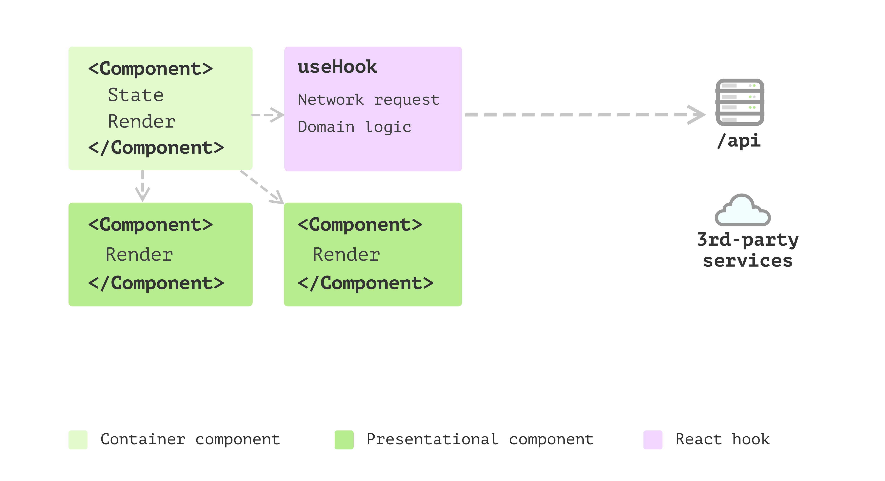
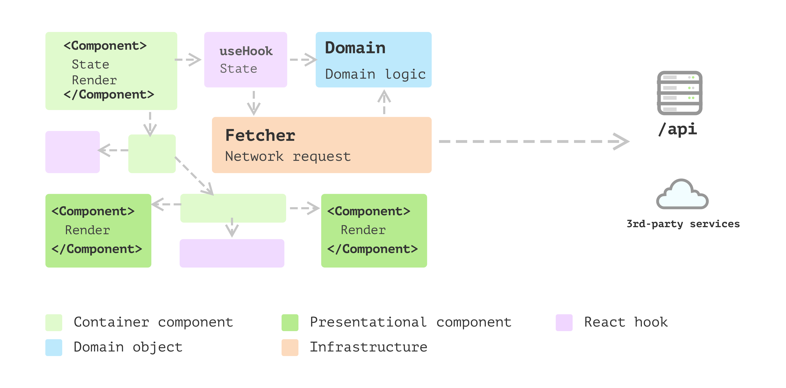
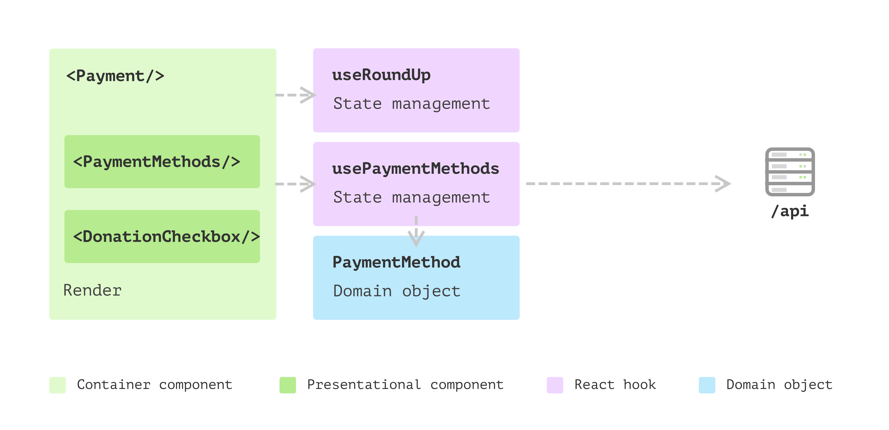

# The patterns of building "React" applications

Firstly, there isn't such a thing as React application. I mean, there are front-end applications written in JavaScript or TypeScript that happen to use React as their views. However, I think it's not fair to call them React applications, just as we wouldn't call a Java EE application JSP application. 

More often than not, people squeeze different things into React components or hooks to make the application work. This type of less-organised structure isn't a problem if the application is small or mostly without much business logic. However, as more business logic shifted to front-end in many cases, this everything-in-component shows problems. To be more specific, the effort of understanding such type of code is relatively high, as well as the increased risk to code modification.

In this article, I would like to discuss a few patterns and techniques you can use to reshape your “React application" into a regular one, and only with React as its view (you can even swap these views into another view libray without too much efforts). 

The critical point here is you should analyse what role each part of the code is playing within an application (even on the surface, they might be packed in the same file). Separate view from no-view logic, split the no-view logic further by their responsibilities and place them in the **right** places.

The benefit of this separation is that it allows you to make changes in the underlying domain logic without worrying too much about the surface views, or vice versa. Also, it can increase the reusability of the domain logic in other places as they are not coupled to any other parts.

## React is a humble library for building views

It's easy to forget that React, at its core, is a library (not a framework) that helps you build the user interface.

> A JavaScript library for building user interfaces
> -- React Homepage

It may sound pretty straightforward. But I have seen many cases where people write the data fetching, reshaping logic right in the place where it's consumed. For example, fetching data inside a React component, in the `useEffect` block right above the rendering, or performing data mapping/transforming once they got the response from the server side. 

```js
// ...

useEffect(() => {
  fetch("https://address.service/api")
    .then((res) => res.json())
    .then((data) => {
      const addresses = data.map((item) => ({
        street: item.streetName,
        address: item.streetAddress,
        postcode: item.postCode,
      }));

      setAddresses(addresses);
    });
});

// the actual rendering...
```

Perhaps because there is yet to be a universal standard in the frontend world, or it's just a bad programming habit. Frontend applications should not be treated too differently from regular software applications. In the frontend world, you still use separation of concerns in general to arrange the code structure. And all the proven useful design patterns still apply.

## Welcome to the real world React application

Most developers were impressed by React's simplicity and the idea that a user interface can be expressed as a pure function to map data into the DOM. And to a certain extent, *it IS*. 

But developers start to struggle when they need to send a network request to a backend or perform page navigation, as these **side effects** make the component less “pure”. And once you consider these different states (either global state or local state), things quickly get complicated, and the dark side of the user interface emerges. 

### Apart from the user interface

React itself doesn’t care much about where to put calculation or business logic, which is fair as it’s only a library for building user interfaces. And beyond that view layer, a frontend application has other parts as well. To make the application work, you will need a router, local storage, cache at different levels, network requests, 3rd-party integrations, 3rd-party login, security, logging, performance tuning, etc.

With all this extra context, **trying to squeeze everything into React components or hooks** is generally not a good idea. The reason is mixing concepts in one place generally leads to more confusion. At first, the component sets up some network request for order status, and then there is some logic to trim off leading space from a string and then navigate somewhere else. The reader must constantly reset their logic flow and jump back and forth from different levels of details.

Packing all the code into components may work in small applications like a Todo or one-form application. Still, the efforts to understand such application will be significant once it reaches a certain level. Not to mention adding new features or fixing existing defects.

If we could separate different concerns into files or folders with structures, the mental load required to understand the application would be significantly reduced. And you only have to focus on one thing at a time. Luckily, there are already some well-proven patterns back to the pre-web time. These design principles and patterns are explored and discussed well to solve the common user interface problems - but in the desktop GUI application context.

In [this article](https://martinfowler.com/bliki/PresentationDomainDataLayering.html), Martin Fowler has a great summary of the concept of view-model-data layering. 

> On the whole I've found this to be an effective form of modularization for many applications and one that I regularly use and encourage. It's biggest advantage is that it allows me to increase my focus by allowing me to think about the three topics (i.e., view, model, data) relatively independently. 

Layered architectures have been used to cope the challenges in large GUI applications, and certainly we can use these established patterns of front-end organization in our "React applications".

## The evolution of a React application

For small or one-off projects, you might find that all logic is just written inside React components. You may see one or only a few components in total. The code looks pretty much like HTML, with only some variable or state used to make the page "dynamic". Some might send requests to fetch data on `useEffect` after the components render.

As the application grows, and more and more code are added to codebase. Without a proper way to organise them, soon the codebase will turn into unmaintainable state, meaning that even adding small features can be time-consuming as developers need more time to read the code.

So I'll list a few steps that can help to relief the maintainable problem. It generally require a bit more efforts, but it will pay off to have the structure in you application. Let's have a quick review of these steps to build front-end applications that scale.

### Single Component Application 

It can be called pretty much a Single Component Application:


But soon, you realise one single component requires a lot of time just to read what is going on. For example, there is logic to iterate through a list and generate each item. Also, there is some logic for using 3rd-party components with only a few `configuration` code, apart from other logic. 

### Multiple Component Application 

You decided to split the component into several components, with these structures reflecting what's happening on the result HTML is a good idea, and it helps you to focus on one component at a time.


And as your application grows, apart from the view, there are things like sending network requests, converting data into different shapes for the view to consume, and collecting data to send back to the server. And having this code inside components doesn't feel right as they're not really about user interfaces. Also, some components have too many internal states.

### State management with hooks

It's a better idea to split this logic into a separate places. Luckily in React, you can define your own hooks. This is a great way to share these `state` and the logic of whenever states change.



That's awesome! You have a bunch of elements extracted from your single component application, and you have a few pure presentational components and some reusable hooks that make other components stateful. The only problem is that in hooks, apart from the side effect and state management, some logic doesn't seem to belong to the `state` management but pure calculations. 

### Business models emerged

So you've started to become aware that extracting this logic into yet another place can bring you many benefits. For example, with that split, the logic can be cohesive and independent of any views. Then you extract a few domain objects. 

These simple objects can handle data mapping (from one format to another), check nulls and use fallback values as required. Also, as the amount of these domain objects grows, you find you need some inheritance or polymorphism to make things even cleaner. Thus you applied many design patterns you found helpful from other places into the front-end application here.



### Layered frontend application

The application keeps evolving, and then you find some patterns emerge. There are a bunch of objects that do not belong to any user interface, and they also don't care about whether the underlying data is from remote service, local storage or cache. And then, you want to split them into different layers.


The above evolution process is a high-level overview, and you should have a taste of how you should structure your code or at least what the direction should be. However, there will be many details you need to consider before applying the theory in your application.

In the following sections, I'll walk you through a feature I extracted from a real project to demonstrate all the patterns and design principles I think useful for big frontend applications. 

## Introduction of the Payment feature

I’m using an oversimplified online ordering application as a starting point. In this application, a customer can pick up some products and add them to the order, and then they will need to select one of the payment methods to continue. 


These payment method options are configured on the server side, and customers from different countries may see other options. For example, Apple Pay may only be popular in some countries. The radio buttons are data-driven - whatever is fetched from the backend service will be surfaced. The only exception is that when no configured payment methods are returned, we don’t show anything and treat it as `pay in cash` by default.

For simplicity, I’ll skip the actual payment process and focus on the `Payment` component. Let’s say that after reading the React hello world doc and a couple of `stackoverflow` searches, you came up with some code like this:

```tsx
export const Payment = ({ amount }: { amount: number }) => {
  const [paymentMethods, setPaymentMethods] = useState<LocalPaymentMethod[]>(
    []
  );

  useEffect(() => {
    const fetchPaymentMethods = async () => {
      const url = "https://online-ordering.com/api/payment-methods";

      const response = await fetch(url);
      const methods: RemotePaymentMethod[] = await response.json();

      if (methods.length > 0) {
        const extended: LocalPaymentMethod[] = methods.map((method) => ({
          provider: method.name,
          label: `Pay with ${method.name}`,
        }));
        extended.push({ provider: "cash", label: "Pay in cash" });
        setPaymentMethods(extended);
      } else {
        setPaymentMethods([]);
      }
    };

    fetchPaymentMethods();
  });

  return (
    <div>
      <h3>Payment</h3>
      <div>
        {paymentMethods.map((method) => (
          <label key={method.provider}>
            <input
              type="radio"
              name="payment"
              value={method.provider}
              defaultChecked={method.provider === "cash"}
            />
            <span>{method.label}</span>
          </label>
        ))}
      </div>
      <button>${amount}</button>
    </div>
  );
};
```

The code above is pretty typical. You might have seen it in the get started tutorial somewhere. And it's not necessary bad. However, as we mentioned above, the code has mixed different concerns all in a single component and makes it a bit difficult to read.


### The problem with the initial implementation

The first issue I would like to address is how **busy** the component is. By that, I mean `Payment` deals with different things and makes the code difficult to read as you have to switch context in your head as you read. It's not a big problem at this stage for this simple example. However, as the code gets bigger and more complex, we'll need to refactoring them a bit.

It’s good practice to split view and non-view code into separate places. The reason is, in general, views are changing more frequently than non-view logic. Also, as they deal with different aspects of the application, separating them allows you to focus on a particular self-contained module that is much more manageable when implementing new features.

### The split of view and non-view code 

In React, we can use a custom hook to maintain `state` of a component while keeping the component itself more or less `stateless`. We can use `Extract Function` to create a function called `usePaymentMethods` (the prefix `use` is a convention in React to indicate the function is a hook and handling some states in it):

```tsx
const usePaymentMethods = () => {
  const [paymentMethods, setPaymentMethods] = useState<LocalPaymentMethod[]>(
    []
  );

  useEffect(() => {
    const fetchPaymentMethods = async () => {
      const url = "https://online-ordering.com/api/payment-methods";

      const response = await fetch(url);
      const methods: RemotePaymentMethod[] = await response.json();

      if (methods.length > 0) {
        const extended: LocalPaymentMethod[] = methods.map((method) => ({
          provider: method.name,
          label: `Pay with ${method.name}`,
        }));
        extended.push({ provider: "cash", label: "Pay in cash" });
        setPaymentMethods(extended);
      } else {
        setPaymentMethods([]);
      }
    };

    fetchPaymentMethods();
  });

  return {
    paymentMethods,
  };
};
```

This returns a `paymentMethods` array (in type `LocalPaymentMethod`) as internal state and is ready to be used in `rendering`. So the logic in `Payment` can be simplified as:

```tsx
export const Payment = ({ amount }: { amount: number }) => {
  const { paymentMethods } = usePaymentMethods();

  return (
    <div>
      <h3>Payment</h3>
      <div>
        {paymentMethods.map((method) => (
          <label key={method.provider}>
            <input
              type="radio"
              name="payment"
              value={method.provider}
              defaultChecked={method.provider === "cash"}
            />
            <span>{method.label}</span>
          </label>
        ))}
      </div>
      <button>${amount}</button>
    </div>
  );
};
```

This helps relieve the pain in the `Payment` component. However, if you look at the block for iterating through `paymentMethods`, it seems a concept is missing here. In other words, this block deserves its own component. Ideally, we want each component to focus on, only one thing.

### Split the view by extracting sub component

Also, if we can make a component a pure function - meaning given any input, the output is certain - that would help us a lot in writing tests, understanding the code and even reusing the component elsewhere. After all, the smaller a component, the more likely it will be reused.

We can use `Extract Function` again (maybe we should call it `Extract Component`, but in React, a component is a function anyway).

```tsx
const PaymentMethods = ({ options }: { options: LocalPaymentMethod[] }) => (
  <Fragment>
    {options.map((option) => (
      <label key={option.provider}>
        <input
          type="radio"
          name="payment"
          value={option.provider}
          defaultChecked={option.provider === "cash"}
        />
        <span>{option.label}</span>
      </label>
    ))}
  </Fragment>
);
```

The `Payment` component can use the `PaymentMethods` directly and thus be simplified as below:

```tsx
const Payment = ({ amount }: { amount: number }) => {
  const { paymentMethods } = usePaymentMethods();

  return (
    <div>
      <h3>Payment</h3>
      <div>
        <PaymentMethods options={paymentMethods} />
      </div>
      <button>${amount}</button>
    </div>
  );
};
```

Note that `PaymentMethods` is a pure function (a pure component) that doesn’t have any state. It’s basically a string formatting function.

### Data modelling to encapsulate logic

So far, the changes we have made are all about splitting view and non-view code into different places. It works well. The hook handles data fetching and reshaping. Both `Payment` and `PaymentMethods` are relatively small and easy to understand.

However, if you look closely, there is still room for improvement. To start with, in the pure function component `PaymentMethods`, we have a bit of logic to check if a payment method should be checked by default:

```tsx
defaultChecked={method.provider === "cash"}
```

These test statements in a view can be considered a logic leak, and gradually they can be scatted in different places and make modification harder.

Another point of potential logic leakage is in the data conversion where we fetch data:

```tsx
if (methods.length > 0) {
  const extended: LocalPaymentMethod[] = methods.map((method) => ({
    provider: method.name,
    label: `Pay with ${method.name}`,
  }));
  extended.push({ provider: "cash", label: "Pay in cash" });
  setPaymentMethods(extended);
} else {
  setPaymentMethods([]);
}
```

Note the anonymous function inside `methods.map` does the conversion silently, and this logic, along with the `method.provider === "cash"` above can be extracted into a class.

We could have a class `PaymentMethod` with the data and behaviour centralised into a single place:

```tsx
class PaymentMethod {
  private remotePaymentMethod: RemotePaymentMethod;

  constructor(remotePaymentMethod: RemotePaymentMethod) {
    this.remotePaymentMethod = remotePaymentMethod
  }

  get provider() {
    return this.remotePaymentMethod.name;
  }

  get label() {
    if(this.provider === 'cash') {
      return `Pay in ${this.provider}`
    }
    return `Pay with ${this.provider}`;
  }

  get isDefaultMethod() {
    return this.provider === 'cash';
  }
}
```

With the class, I can define the default cash payment method:

```tsx
const payInCash = new PaymentMethod({ name: "cash" });
```

And during the conversion - after the payment methods are fetched from the remote service - I can construct the `PaymentMethod` object in-place like so:

```tsx
if (methods.length > 0) {
  const extended: PaymentMethod[] = methods.map(
    (method) => new PaymentMethod(method)
  );
  extended.push(payInCash);
  setPaymentMethods(extended);
} else {
  setPaymentMethods([]);
}
```

And even extract a small function called `convertPaymentMethods`:

```tsx
const convertPaymentMethods = (methods: RemotePaymentMethod[]) => {
  if (methods.length === 0) {
    return [];
  }

  const extended: PaymentMethod[] = methods.map(
    (method) => new PaymentMethod(method)
  );
  extended.push(payInCash);

  return extended;
};
```

Also, in the `PaymentMethods` component, we don’t use the `method.provider === "cash"`to check anymore, and instead call the `getter`:

```tsx
{
  options.map((option) => (
    <label key={option.provider}>
      <input
        type="radio"
        name="payment"
        value={option.provider}
        defaultChecked={option.isDefaultMethod}
      />
      <span>{option.label}</span>
    </label>
  ));
}
```

Now we’re restructuring our `Payment` component into a bunch of smaller parts that work together to finish the work.


### The benefits of the new structure

- Having a class encapsulates all the logic around a payment method. It’s a domain object and doesn’t have any UI-related information. So testing and potentially modifying logic here is much easier than when embedded in a view.
- The new extracted component `PaymentMethods` is a pure function and only depends on a domain object array, which makes it super easy to test and reuse elsewhere. We might need to pass in a `onSelect` callback to it, but even in that case, it’s a pure function and doesn’t have to touch any external states.
- Each part of the feature is clear. If a new requirement comes, we can navigate to the right place without reading all the code.

I have to make the example in this article sufficiently complex so that many patterns can be extracted. All these patterns and principles are there to help simplify our code's modifications.

## New requirement: donate to a charity

Let’s examine the theory here with some further changes to the application. The new requirement is that we want to offer an option for customers to donate a small amount of money as a tip to a charity along with their order.

For example, if the order amount is $19.80, we ask if they would like to donate $0.20. And if a user agrees to donate it, we’ll show the total number on the button.


Before we make any changes, let's have a quick look at the current code structure. I prefer have different parts in their folder so it's easy for me to navigate when it grows bigger.

```
src
├── App.tsx
├── components
│   ├── Payment.tsx
│   └── PaymentMethods.tsx
├── hooks
│   └── usePaymentMethods.ts
├── models
│   └── PaymentMethod.ts
└── types.ts
```

`App.tsx` is the main entry, it uses `Payment` component, and `Payment` uses `PaymentMethods` for rendering different payment options. The hook `usePaymentMethods` is responsible for fetching data from remote service and then convert it to a `PaymentMethod` domain object that is used to hold `label` and the `isDefaultChecked` flag. 

### Internal state: agree to donation

To make these changes in `Payment`, we need some additional `state` variables. To be more specific, a boolean `agreeToDonate` will be used to indicate whether a user selected the checkbox on the page, in addition to `total` and `tip`, to show the total number when they agreed and the tip in the checkbox label, respectively.

```tsx
const Payment = ({ amount }: { amount: number }) => {
  const [agreeToDonate, setAgreeToDonate] = useState<boolean>(false);

  const { total, tip } = useMemo(
    () => ({
      total: agreeToDonate ? Math.floor(amount + 1) : amount,
      tip: parseFloat((Math.floor(amount + 1) - amount).toPrecision(10)),
    }),
    [amount, agreeToDonate]
  );

  // rendering 
}
```

The function`Math.floor` will round the number up so we can get the correct amount when the user selects `agreeToDonate`, and the difference between `rounded-up` value and the original amount will be the `tip`.

And for the view, the JSX will be a `checkbox` plus a short description:

```tsx
return (
  //...
  <div>
    <label>
      <input
        type="checkbox"
        onChange={handleChange}
        checked={agreeToDonate}
      />
      <p>{agreeToDonate
        ? "Thanks for your donation."
        : `I would like to donate $${tip} to charity.`}</p>
    </label>
  </div>
  <button>${total}</button>
  //...
);
```

With these new changes, our code starts handling multiple things again. It’s essential always to stay alert for potential mixing of view and non-view code. If you find any unnecessary mixing, look for ways to split them.

### Extract a hook to the rescue

Here we need an object to calculate the tip and amount, and whenever a user changes their mind, the object should return the updated amount and tip.

So it sounds like we need an object that:

- takes the original amount as input
- returns `total` and `tip` whenever `agreeToDonate` changed.

It sounds like a perfect place for a custom hook again, right?

```tsx
const useRoundUp = (amount: number) => {
  const [agreeToDonate, setAgreeToDonate] = useState<boolean>(false);

  const { total, tip } = useMemo(
    () => ({
      total: agreeToDonate ? Math.floor(amount + 1) : amount,
      tip: parseFloat((Math.floor(amount + 1) - amount).toPrecision(10)),
    }),
    [amount, agreeToDonate]
  );

  const updateAgreeToDonate = () => {
    setAgreeToDonate((agreeToDonate) => !agreeToDonate);
  };

  return {
    total,
    tip,
    agreeToDonate,
    updateAgreeToDonate
  }
}
```

And in the view, we can call this hook with the initial `amount` and have all these states defined externally. The `updateAgreeToDonate` function can update the value in the hook and trigger a re-render.

```tsx
const Payment = ({ amount }: { amount: number }) => {
  //...
  const { total, tip, agreeToDonate, updateAgreeToDonate } = useRoundUp(amount);

  return (
      //...
      <div>
        <label>
          <input
            type="checkbox"
            onChange={updateAgreeToDonate}
            checked={agreeToDonate}
          />
          <p>{agreeToDonate
            ? "Thanks for your donation."
            : `I would like to donate $${tip} to charity.`}</p>
        </label>
      </div>
      <button>${total}</button>
      //...
  );
};
```

We can also extract the message formatting part into the helper function:

```tsx
const formatCheckboxLabel = (agreeToDonate: boolean, tip: number) => {
  return agreeToDonate
    ? "Thanks for your donation."
    : `I would like to donate $${tip} to charity.`
}
```

And the `Payment` component can be simplified a lot - the states are now fully managed in hook `useRoundUp`.

You can imagine a hook as a state machine behind a view whenever some change happens in the UI, say, a checkbox change event. The event will be sent to the state machine to generate a new state, and the new state will trigger a re-render.

So the pattern here is that we should move state management away from a component and try to make it a pure function (so it can be easily tested and reused just like these humble utility functions). The React hook was designed to share reusable logic from different components, but I find it beneficial even when there is only one use as it helps you to focus on rendering in a component and keeping state and data in hooks.

As the donation checkbox becomes more independent, we can move it into its own pure function component.

```tsx
const DonationCheckbox = ({
  onChange,
  checked,
  content,
}: DonationCheckboxProps) => {
  return (
    <div>
      <label>
        <input type="checkbox" onChange={onChange} checked={checked} />
        <p>{content}</p>
      </label>
    </div>
  );
};
```

While in `Payment`, thanks to the declarative UI in React, it’s pretty straightforward to read the code like a humble piece of HTML.

```tsx
export const Payment = ({ amount }: { amount: number }) => {
  const { total, tip, agreeToDonate, updateAgreeToDonate } =
    useRoundUp(amount);
  const { paymentMethods } = usePaymentMethods();

  return (
    <div>
      <h3>Payment</h3>
      <PaymentMethods paymentMethods={paymentMethods} />
      <DonationCheckbox
        onChange={updateAgreeToDonate}
        checked={agreeToDonate}
        content={formatCheckboxLabel(agreeToDonate, tip)}
      />
      <button>${total}</button>
    </div>
  );
};
```

And at this point, our code structure starts to resemble something like the diagram below. Note how different parts focus on their own tasks and come together to make the process work.



### More changes about round-up logic

The round-up looks good so far, and as the business expands to other countries, it comes with new requirements. The same logic doesn’t work in Japan market as 0.1 Yen is too small as a donation, and it needs to round up to the nearest hundred for the Japanese currency. And for Denmark, it needs to round up to the nearest tens.

It sounds like an easy fix. All I need is a `countryCode` passed into the `Payment` component, right?

```tsx
<Payment amount={3312} countryCode='JP' />
```

And because all of the logic is now defined in the `useRoundUp` hook, I can also pass the `countryCode` through to the hook.

```tsx
const useRoundUp = (amount: number, countryCode: string) => {
  //...

  const { total, tip } = useMemo(
    () => ({
      total: agreeToDonate
        ? countryCode === "JP"
          ? Math.floor(amount / 100 + 1) * 100
          : Math.floor(amount + 1)
        : amount,
      //...
    }),
    [amount, agreeToDonate, countryCode]
  );
  //...
}
```

You will notice that the if-else can go on and on as a new `countryCode` is added in the `useEffect` block. And for the `getTipMessage`, we need the same if-else checks as a different country may use other currency sign (instead of a dollar sign by default):

```tsx
const formatCheckboxLabel = (
  agreeToDonate: boolean,
  tip: number,
  countryCode: string
) => {
  const currencySign = countryCode === "JP" ? "¥" : "$";

  return agreeToDonate
    ? "Thanks for your donation."
    : `I would like to donate ${currencySign}${tip} to charity.`;
};
```

One last thing we also need to change is the currency sign on the button:

```tsx
<button>
  {countryCode === "JP" ? "¥" : "$"}
  {total}
</button>
```

### The shotgun surgery problem

This scenario is the famous “shotgun surgery” anti-pattern we see in many places (not particularly in React applications). This essentially says that we'll have to touch several modules whenever we need to modify the code for either a bug fixing or adding a new feature. And indeed, it’s easier to make mistakes with this many changes, especially when your tests are insufficient. 


As illustrated above, the coloured lines indicate branches of country code checks that cross many files. In views, we’ll need to do separate things for different country code, while in hooks, we’ll need similar branches. And whenever we need to add a new country code, we’ll have to touch all these parts.

For example, if we consider `Denmark` as a new country the business is expanding to, we’ll end up with code in many places like:

```ts
const currencySignMap = {
  JP: "¥",
  DK: "Kr.",
  AU: "$",
};

const getCurrencySign = (countryCode: CountryCode) =>
  currencySignMap[countryCode];
```

One possible solution for the problem of having branches scattered in different places is to use polymorphism to replace these switch cases or table look-up logic.

### Polymorphism to the rescue

The first thing we can do is examine all the branches and see what they are actually testing. For example, different countries have different currency signs, so `getCurrencySign` can be extracted into a public interface. Also, other countries might have different round-up algorithms.

```ts
export interface PaymentStrategy {
  getCurrencySign(): string;

  getRoundUpAmount(amount: number): number;

  getTip(amount: number): number;
}
```

A concrete implementation of the strategy interface would be like following the code snippet: `PaymentStrategyAU`. Note here the interface and classes have nothing to do with the UI directly. This logic can be shared in other places in the application or even moved to backend services (if the backend is written in Node, for example).

```ts
export class PaymentStrategyAU implements PaymentStrategy {
  getCurrencySign(): string {
    return "$";
  }

  getRoundUpAmount(amount: number): number {
    return Math.floor(amount + 1);
  }

  getTip(amount: number): number {
    return parseFloat(
      (this.getRoundUpAmount(amount) - amount).toPrecision(10)
    );
  }
}
```

We could have subclasses for each country, and each has the country specific round-up logic. However, as function is the first-class citizen in JavaScript, we can pass in the round-up algorithm into the strategy implementation to make the code less overhead without subclasses.

```ts
class PaymentStrategy {
  private readonly currencySign: string;
  private readonly algorithm: RoundUpStrategy;

  public constructor(currencySign: string, roundUpAlgorithm: RoundUpStrategy) {
    this.currencySign = currencySign;
    this.algorithm = roundUpAlgorithm;
  }

  getCurrencySign(): string {
    return this.currencySign;
  }

  getRoundUpAmount(amount: number): number {
    return this.algorithm(amount);
  }

  getTip(amount: number): number {
    return calculateTipFor(this.getRoundUpAmount.bind(this))(amount);
  }
}
```

As illustrated below, we only invoke methods from the abstract interface (the grey lines) in each call site. They do not depend on scattered logic anymore but the single class `PaymentStrategy`. And at runtime, we can easily substitute one instance of `strategy` for another (the red, green and blue square indicates different instances of `PaymentStrategy` class).


And the `useRoundUp` hook, the code could be simplified as:

```tsx
const useRoundUp = (amount: number, strategy: PaymentStrategy) => {
  //...
  const { total, tip } = useMemo(
    () => ({
      total: agreeToDonate ? strategy.getRoundUpAmount(amount) : amount,
      tip: strategy.getTip(amount),
    }),
    [strategy, amount, agreeToDonate]
  );
  
  //...
  return {
    total,
    tip,
    agreeToDonate,
    updateAgreeToDonate,
  };
};
```

In the `Payment` component, we pass the strategy from `props` through to the hook:

```tsx
export const Payment = ({
  amount,
  strategy,
}: {
  amount: number;
  strategy: PaymentStrategy;
}) => {
  const { total, tip, agreeToDonate, updateAgreeToDonate } =
    useRoundUp(amount, strategy);
    //...

  return (
      //...
      <DonationCheckbox
        onChange={updateAgreeToDonate}
        checked={agreeToDonate}
        content={formatCheckboxLabel(agreeToDonate, tip, strategy)}
      />
      //...
  );
};
```

The prop `strategy` here is defined as `PaymentStrategy` interface, and at runtime, we would pass in an instance of a class that implements that interface. Like, `PaymentStrategyAU` or `PaymentStrategyJP`.

Note that I also extracted a few helper functions for the labels:

```tsx
const formatCheckboxLabel = (
  agreeToDonate: boolean,
  tip: number,
  strategy: PaymentStrategy
) => {
  const currencySign = strategy.getCurrencySign();
  return agreeToDonate
    ? "Thanks for your donation."
    : `I would like to donate ${currencySign}${tip} to charity.`;
};

const formatButtonLabel = (strategy: PaymentStrategy, total: number) =>
  `${strategy.getCurrencySign()}${total}`;
```

I hope you have noticed that we’re trying to extract non-view related code either directly or by abstracting new mechanisms into separate places. You can think of it this way: the React view is only one of the consumers of your non-view code.

For example, if you would build a new interface - maybe with `vue` or even a command line tool - how much code can you reuse with your current implementation?

### Push the design a bit further: extract a network client

If I keep this "Separation of Concerns" mindset (for spliting view and non-view logic, or more broadly split different responsibility into its own funciton/class/object), the next step is to do something to relieve the mixing in `usePaymentMethods` hook. 

At the moment, that hook doesn’t have much code. If I add things like error handling and retries, it can easily bloat. Also hooks are a React concept, and you cannot reuse it directly in your next fancy `vue` view, right?

```tsx
export const usePaymentMethods = () => {
  //...
  useEffect(() => {
    const fetchPaymentMethods = async () => {
      const url =
        "https://online-ordering.com/api/payment-methods";

      const response = await fetch(url);
      const methods: RemotePaymentMethod[] = await response.json();

      setPaymentMethods(convertPaymentMethods(methods));
    };

    fetchPaymentMethods();
  });
  //...
};
```

I have extracted `convertPaymentMethods` here as a global function. I'd like to move the fetching logic into a separate function so I can use library like `react-query` to handle all the network-related headaches for me. 

```tsx
const fetchPaymentMethods = async () => {
  const response = await fetch("https://online-ordering.com/api/payment-methods");
  const methods: RemotePaymentMethod[] = await response.json();

  return convertPaymentMethods(methods)
}
```

This small class does two things, fetch and convert. It acts like an `Anti-Corruption Layer` that can ensure our change to the `PaymentMethod` structure is limited to a single file. The benefit of this split is that, again, the class can be used whenever needed, even in the backend service, just like the `Strategy` objects we saw above.

And for the `usePaymentMethods` hook, the code is pretty simple now:

```ts
export const usePaymentMethods = () => {
  const [paymentMethods, setPaymentMethods] = useState<PaymentMethod[]>(
    []
  );

  useEffect(() => {
    fetchPaymentMethods().then(methods => setPaymentMethods(methods))
  });

  return {
    paymentMethods,
  };
};
```

And our class diagram is changed into something like the one below. We have most of the code moved into non-view related files that can be used in other places (we will see an example in the next section).


## The benefits of having these layers

The layers bring us clean boundaries and separation of concerns. One of the major benefits of the separation is that, if we have to (even very unlikely in most projects), we can replace the view without changing the underlying models and logic. All because the domain logic is encapsulated in pure JavaScript (or TypeScript) code and isn't aware of the existence of views.

## Conclusion

Building React application, or a frontend application with React as its view, should not be treated as a new type of software. Most of the patterns and principles for building the traditional user interface still apply. Even the patterns for constructing a headless service in the backend are also valid in the frontend field. We can use layers in the frontend and have the user interface as thin as possible, sink the logic into a supporting model layer, and data access into another.

The benefit of having these layers in frontend applications is that you only need to understand one piece without worrying about others. Also, with the improvement of reusability, making changes to existing code would be relatively more manageable than before. 
