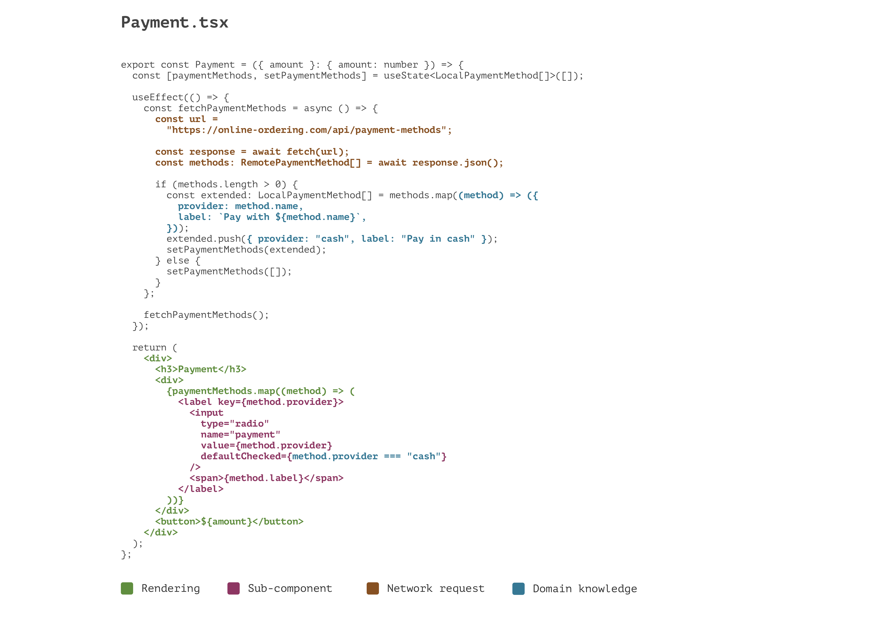
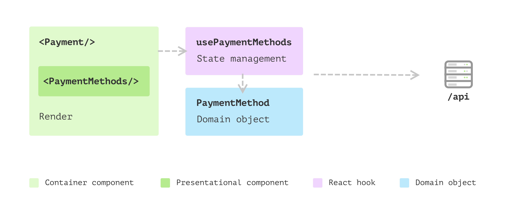
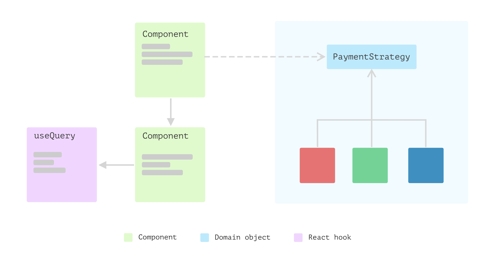
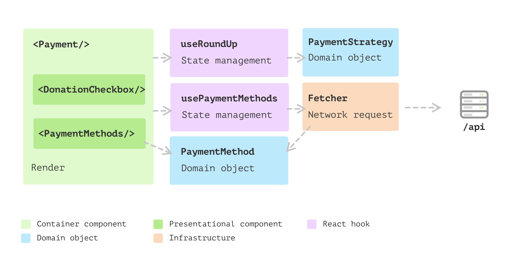

# There is no such thing as a React application.

Like it or not, there is no such thing as a React application. I mean, there are front-end applications written in JavaScript or TypeScript that happen to use React as their view layer. More often than not, people squeeze different things into React components or hooks to make the application work, but the effort of understanding the code with these *ad hoc* additions is relatively high, as well as the increased risk to code modification.

It's easy to forget that React, at its core, is a library (not a framework) that helps you build the user interface.

> A JavaScript library for building user interfaces
> -- React Homepage

In this article, I would like to discuss a few patterns and techniques you can use to reshape your “React application" into a regular one, but with React as its view only. The benefit of this separation is that you will be more confident to make changes in the underlying domain logic without worrying too much about the surface views, and vice versa.

It may sound pretty straightforward, however, while implementing concrete features, several details need to be examined and sometimes, you may need to trade off a few other things.
## Welcome to the real world React application

Most developers were impressed by React's simplicity and the idea that a user interface is only a pure function to map data into the DOM. And it is in some way if you look at this example of rendering static data on the page in React:

```tsx
const TDDSteps = () => {
  const steps = [
    "write a test and see it fail",
    "make it pass with the simplest code",
    "refactoring",
  ];

  return (
    <ol>
      {steps.map((step) => (
        <li>{step}</li>
      ))}
    </ol>
  );
};
```

This code will generate an ordered list with three items, just as you would expect. This declarative way of writing the user interface is also easy to understand and intuitive compared to prior libraries like `Backbone` or `jQuery`, which provide imperative APIs for writing user interfaces.

The difference between imperative and declarative approaches is pretty apparent. With imperative code, you will have to think in detail about **how** to use lower level APIs to compose the UI, while declarative code is more like describing **what** you want to display on a page.

```tsx
$(function () {
  const container = $("#root");

  const steps = [
    "write a test and see it fail",
    "make it pass with the simplest code",
    "refactoring"
  ];

  const list = $("<ol>");
  steps.forEach(function (step) {
    return $("<li>").text(step).appendTo(list);
  });

  container.append(list);
});
```

Apart from the elegant and declarative APIs in React, its pure functions and virtual DOM are also brilliant in making the code readable and performant. But developers start to struggle when they need to send a network request to a backend service or perform page navigation, as these side effects make the component less “pure”. And once you consider these different states (either global state or local state), things quickly get complicated, and the dark side of the user interface emerges. 

Developers have tried to fix these problems in many different ways. State management libraries like `redux` and `mobX` were popular for a while until people realised they were way too complicated. Also, each library seems to have its own paradigm, terms and patterns, and there are always more concepts  than you need to build a “simple” front-end application. 

To make this matter worse, the backend never returns the data the front-end expects, so there will be a lot of logic needed to convert data from one shape to another, perform calculations, etc. I’ll address this in an example below. 

### Frontend applications have many parts

React itself doesn’t care much about where to put the calculation or business logic, which is fair as it’s only a library for building user interfaces. And beyond that view layer, a frontend application has other parts as well. To make the application work, you will need a router, local storage, cache in different levles, network requests, 3rd-party integrations, 3rd-party login, security, logging, performance tuning etc.

With all these context, **trying to squeeze everything into React components or hooks** obviouly not a good idea. And in the real world, that approach will either not work, or it works only in a tiny application but can’t scale. 

And the solution is to rethink the front-end application structure, figure out where the complexity comes from, and then try to apply design principles and patterns we learnt in traditional application development. 

In [this article](https://martinfowler.com/bliki/PresentationDomainDataLayering.html), Martin Fowler had a great summary of the idea of having the view-model-data layering. And the idea here is that even in frontend application itself, when it grows to a certain level of complicatiy, we can borrow the principle as well.

> On the whole I've found this to be an effective form of modularization for many applications and one that I regularly use and encourage. It's biggest advantage (for me) is that it allows me to reduce the scope of my attention by allowing me to think about the three topics relatively independently. 

For example, to handle these issues (they are not new problems, by the way), the Layered Architecture has been used, and it works well in most cases. Also, the MVC, MVP and other patterns for solving complicated software problems are widely used in other fields of software, and there is no reason we should not use them in frontend world.

So in the following sections, I'll walk you through a feature I excerpted from a real project to demonstrate all the patterns and design principles I think useful for big frontend applications. 

## Introduction of the Payment feature

I’m using the oversimplified payment section as a starting point. In the online ordering application, a customer can pick up some products and add them to the order, and then they will need to select one of the payment methods to continue. 


These payment method options are configured on the server side, and customers from different countries may see other options. For example, Apple Pay may only be popular in some countries. The radio buttons are data-driven - whatever is fetched from the backend service will be surfaced. The only exception is that if none configured payment methods are returned, we don’t show anything and treat it as `pay in cash` by default.

For simplicity, I’ll skip the actual payment process and focus on the `Payment` component. Let’s say after reading the React hello world doc and a couple of `stackoverflow` searches. You came up with some code like this initially:

```tsx
export const Payment = ({ amount }: { amount: number }) => {
  const [paymentMethods, setPaymentMethods] = useState<LocalPaymentMethod[]>([]);

  useEffect(() => {
    const fetchPaymentMethods = async () => {
      const url =
        "https://online-ordering.com/api/payment-methods";

      const response = await fetch(url);
      const methods: RemotePaymentMethod[] = await response.json();

      if (methods.length > 0) {
        const extended: LocalPaymentMethod[] = methods.map((method) => ({
          provider: method.name,
          label: `Pay with ${method.name}`,
        }));
        extended.push({ provider: "cash", label: "Pay in cash" });
        setPaymentMethods(extended);
      } else {
        setPaymentMethods([]);
      }
    };

    fetchPaymentMethods();
  });

  return (
    <div>
      <h3>Payment</h3>
      <div>
        {paymentMethods.map((method) => (
          <label key={method.provider}>
            <input
              type="radio"
              name="payment"
              value={method.provider}
              defaultChecked={method.provider === "cash"}
            />
            <span>{method.label}</span>
          </label>
        ))}
      </div>
      <button>${amount}</button>
    </div>
  );
};
```

I understand that the code is a bit wild, so let me explain it to you. The code does quite a lot of different things in one place, I think it helps if I draw some lines and highlight these different parts.



### Break it down

Firstly, there is a `useEffect` hook before the rendering block (the part that returns JSX at the lower part):

```tsx
//...
const [paymentMethods, setPaymentMethods] = useState<LocalPaymentMethod[]>([]);

useEffect(() => {
  const fetchPaymentMethods = async () => {
    const url =
      "https://online-ordering.com/api/payment-methods";

    const response = await fetch(url);
    const methods: RemotePaymentMethod[] = await response.json();

    if (methods.length > 0) {
      const extended: LocalPaymentMethod[] = methods.map((method) => ({
        provider: method.name,
        label: `Pay with ${method.name}`,
      }));
      extended.push({ provider: "cash", label: "Pay in cash" });
      setPaymentMethods(extended);
    } else {
      setPaymentMethods([]);
    }
  };

  fetchPaymentMethods();
});
//...
```

It defined a `fetchPaymentMethods` function inside, which will `fetch` data from a remote service. It will check if everything goes well and if the returned array has any elements. If there are, it converts the fetched data into a shape defined as `LocalPaymentMethod` and amend one more pre-defined item `cash` into a list, and then sets it as a `state`, named `paymentMethods`.

Note here the response from remote is defined as type `RemotePaymentMethod`, and that type is from the service side that we don’t have control of, so we’ll have to make the conversion here instead so that it can be used in the JSX.

After this big block of code in `Payment` component, there is the actual `render`, which is relatively straightforward thanks to the declarative API. It uses the data passed in (and state data defined by `useState`) for initial rendering, and whenever these data are changed, React will re-render the component.

```tsx
return (
  <div>
    <h3>Payment</h3>
    <div>
      {paymentMethods.map((method) => (
        <label key={method.provider}>
          <input
            type="radio"
            name="payment"
            value={method.provider}
            defaultChecked={method.provider === "cash"}
          />
          <span>{method.label}</span>
        </label>
      ))}
    </div>
    <button>${amount}</button>
  </div>
);
```

Here, we’re iterating through the state `paymentMethods` and mapping each element into a JSX node, which will, in turn, be rendered as a radio button inside a `label`. And after that, there will be a button beneath to show the total amount of an order.

### The problem with the initial implementation

The code snippet above works well, and it’s also passing all my unit tests. But I’m sure you have spotted quite a few code smells already.

The first issue I would like to address is the component is too **busy**. By that, I mean `Payment` deals with different things and makes the code difficult to read as you have to switch context in your head as you read. There are a few lines for a network request, a few others for converting data to another shape, and then the rendering logic itself.

It’s a good practice to split view and non-view code into separate places. The reason is that, in general, views are changing more frequently than this non-view logic. Also, as they deal with different aspects of the application, separating them allows you to focus on a particular self-contained module that is much more manageable when implementing new features.

### The split of view and non-view code 

In React, we can use a custom hook to maintain `state` of a component while remaining the component itself more or less `stateless`. We can use `Extract Function` to create a function `usePaymentMethods` (the prefix `use` is only a convention in React to indicate the function is a hook and handling some states in it):

```tsx
const usePaymentMethods = () => {
  const [paymentMethods, setPaymentMethods] = useState<LocalPaymentMethod[]>([]);

  useEffect(() => {
    const fetchPaymentMethods = async () => {
      const url =
        "https://online-ordering.com/api/payment-methods";

      const response = await fetch(url);
      const methods: RemotePaymentMethod[] = await response.json();

      if (methods.length > 0) {
        const extended: LocalPaymentMethod[] = methods.map((method) => ({
          provider: method.name,
          label: `Pay with ${method.name}`,
        }));
        extended.push({ provider: "cash", label: "Pay in cash" });
        setPaymentMethods(extended);
      } else {
        setPaymentMethods([]);
      }
    };

    fetchPaymentMethods();
  });

  return {
    paymentMethods
  }
}
```

It returns an internal state `paymentMethods` array (in type `LocalPaymentMethod`) and is ready to be used in `rendering`. So logic in `Payment` will be simplified into:

```tsx
export const Payment = ({ amount }: { amount: number }) => {
  const { paymentMethods } = usePaymentMethods();

  return (
    <div>
      <h3>Payment</h3>
      <div>
        {paymentMethods.map((method) => (
          <label key={method.provider}>
            <input
              type="radio"
              name="payment"
              value={method.provider}
              defaultChecked={method.provider === "cash"}
            />
            <span>{method.label}</span>
          </label>
        ))}
      </div>
      <button>${amount}</button>
    </div>
  );
};
```

That helps relieve the pain in the `Payment` component. However, if you look at the block for iterating through `paymentMethods`, it seems a concept is missing here. In other words, this block deserves its own component. We want each component to focus on, ideally, only one thing. 

### Split the view by extracting sub component

Also, if we can make a component a pure function, meaning given any input, the output is certain. That would help us a lot in writing tests, understanding the code and even reusing the component elsewhere. After all, the smaller a component, the more likely it will be reused.

We can use `Extract Function` again (maybe we should call it `Extract Component`, but in React, a component is a function anyways).

```tsx
const PaymentMethods = ({
  paymentMethods,
}: {
  paymentMethods: LocalPaymentMethod[];
}) => (
  <Fragment>
    {paymentMethods.map((method) => (
      <label key={method.provider}>
        <input
          type="radio"
          name="payment"
          value={method.provider}
          defaultChecked={method.provider === "cash"}
        />
        <span>{method.label}</span>
      </label>
    ))}
  </Fragment>
);
```

The `Payment` component can use the `PaymentMethods` directly and thus be simplified as the code snippet below. 

```tsx
const Payment = ({ amount }: { amount: number }) => {
  const {paymentMethods} = usePaymentMethods()

  return (
    <div>
      <h3>Payment</h3>
      <div>
        <PaymentMethods paymentMethods={paymentMethods} />
      </div>
      <button>${amount}</button>
    </div>
  );
};
```

Note that the `PaymentMethods` is a pure function (a pure component) that doesn’t have any state. It’s pretty much like a string formatting function or so.

### Data modelling to encapsulate logic

So far, the changes I have made are all about splitting view and non-view code into different places. It works well. The hook handles data fetching and reshaping. Both `Payment` and `PaymentMethods` are relatively small and easy to understand. 

However, if you look closely, there is still room for improvement. For example, in the pure function component `PaymentMethods`, I have a bit of logic to check if a payment method should be default checked:

```tsx
defaultChecked={method.provider === "cash"}
```

These test statements in a view can be considered a logic leak, and gradually they can be scatted in different places and make the modification harder. 

Another thing about the potential logic leakage was in the data converting when I fetched data from remote:

```tsx
if (methods.length > 0) {
  const extended: LocalPaymentMethod[] = methods.map((method) => ({
    provider: method.name,
    label: `Pay with ${method.name}`,
  }));
  extended.push({ provider: "cash", label: "Pay in cash" });
  setPaymentMethods(extended);
} else {
  setPaymentMethods([]);
}
```

Note the anonymous function inside `methods.map` does the conversion silently, and this logic, along with the `method.provider === "cash"` above can be extracted into a class.

What if I have a class `PaymentMethod` with the data and behaviour centralised into a single place:

```tsx
class PaymentMethod {
  private remotePaymentMethod: RemotePaymentMethod;

  constructor(remotePaymentMethod: RemotePaymentMethod) {
    this.remotePaymentMethod = remotePaymentMethod
  }

  get provider() {
    return this.remotePaymentMethod.name;
  }

  get label() {
    return `Pay with ${this.remotePaymentMethod.name}`;
  }

  get isDefaultMethod() {
    return this.provider === 'cash';
  }
}
```

With the class, I can define a `cash` by default like:

```tsx
const payInCash = new PaymentMethod({name: 'cash'});
```

And during the conversion, after the payment methods are fetched from the remote service. I can construct `PaymentMethod` object in-place like so:

```tsx
if (methods.length > 0) {
  const extended: PaymentMethod[] = methods.map((method) => (new PaymentMethod(method)));
  extended.push(payInCash);
  setPaymentMethods(extended);
} else {
  setPaymentMethods([]);
}
```

Or even extract a small function called `convertPaymentMethods` :

```tsx
const convertPaymentMethods = (methods: RemotePaymentMethod[]) => {
  if (methods.length === 0) {
    return [];
  }

  const extended: PaymentMethod[] = methods.map(
    (method) => new PaymentMethod(method)
  );
  extended.push(payInCash);

  return extended;
};
```

Also, in the `PaymentMethods` component, we don’t use the `method.provider === "cash"`to check anymore, instead call the `getter` :

```tsx
{paymentMethods.map((method) => (
  <label key={method.provider}>
    <input
      type="radio"
      name="payment"
      value={method.provider}
      defaultChecked={method.isDefaultMethod}
    />
    <span>{method.label}</span>
  </label>
))}
```

Now we’re restructuring our `Payment` component into a bunch of smaller parts that work together to finish the work.



And the benefits I can get here are:

- Having a class encapsulates all the logic around a payment method. It’s a domain object and doesn’t have any UI-related information. So testing and potentially modifying logic here is much easier than when embedded in a view.
- The new extracted component `PaymentMethods` is a pure function and only depends on a domain object array, which makes it super easy to test and reuse elsewhere. We might need to pass in a `onSelect` callback to it, but even in that case, it’s a pure function and doesn’t have to touch any external states.
- Each part of the feature is clear. If a new requirement comes, we can navigate to the right place without reading all the code.

I have to make the example in this article complicated so that many patterns can make sense from there. After all, all these patterns and principles are there to help simplify our code's modifications.

## New requirement: donate to a charity

Let’s examine the theory here with some further changes to the application. The new requirement is that we want to offer an option for the customers to donate a few amount of money as a tip to a charity along with their order. 

For example, if the order amount is 19.8, we ask if they would like to donate 0.2. And if a user agrees to donate it, we’ll show the total number on the button.


To make these changes in `Payment`, a few more `state` need to be added. To be more specific, a boolean `agreeToDonate` will be used to indicate whether a user selected the checkbox on the page. Also, we’ll need  `total` and `tip` correspondingly to show the total number when they agreed and the tip in the checkbox label. 

```tsx
const Payment = ({ amount }: { amount: number }) => {
  const [agreeToDonate, setAgreeToDonate] = useState<boolean>(false);

  const { total, tip } = useMemo(
    () => ({
      total: agreeToDonate ? Math.floor(amount + 1) : amount,
      tip: parseFloat((Math.floor(amount + 1) - amount).toPrecision(10)),
    }),
    [amount, agreeToDonate]
  );

  // rendering 
}
```

The function`Math.floor` will round the number up so we can get the correct amount when the user selects `agreeToDonate`, and the difference between `rounded-up` value and the original amount will be the `tip`.

And for the view, the JSX will be a `checkbox` plus a short description:

```tsx
return (
      //...
      <div>
        <label>
          <input
            type="checkbox"
            onChange={handleChange}
            checked={agreeToDonate}
          />
          <p>{agreeToDonate
            ? "Thanks for your donation."
            : `I would like to donate $${tip} to charity.`}</p>
        </label>
      </div>
      <button>${total}</button>
      //...
  );
```

With these new changes, our code started handling more than one thing again. It’s essential always to keep alert about the mixing of view and non-view code. If you find any unnecessary mixing, you should look for ways to split them. 

### Extract a hook to the rescue

Here it seems we need an object to calculate the tip and amount, and whenever a user changes their mind, the object should return the updated amount and tip.

So it sounds like we need an object that:

- takes the original amount as input
- returns `total` and `tip` whenever `agreeToDonate` changed.

It sounds like a perfect usage of a custom hook again, right?

```tsx
const useRoundUp = (amount: number) => {
  const [agreeToDonate, setAgreeToDonate] = useState<boolean>(false);

  const { total, tip } = useMemo(
    () => ({
      total: agreeToDonate ? Math.floor(amount + 1) : amount,
      tip: parseFloat((Math.floor(amount + 1) - amount).toPrecision(10)),
    }),
    [amount, agreeToDonate]
  );

  const updateAgreeToDonate = () => {
    setAgreeToDonate((agreeToDonate) => !agreeToDonate);
  };

  return {
    total,
    tip,
    agreeToDonate,
    updateAgreeToDonate
  }
}
```

And in the view, we can invoke this hook with the initial `amount` and get all these states defined externally. The `updateAgreeToDonate` function can update the value in the hook and trigger a re-render.

```tsx
const Payment = ({ amount }: { amount: number }) => {
  //...
  const { total, tip, agreeToDonate, updateAgreeToDonate } = useRoundUp(amount);

  return (
      //...
      <div>
        <label>
          <input
            type="checkbox"
            onChange={updateAgreeToDonate}
            checked={agreeToDonate}
          />
          <p>{agreeToDonate
            ? "Thanks for your donation."
            : `I would like to donate $${tip} to charity.`}</p>
        </label>
      </div>
      <button>${total}</button>
      //...
  );
};
```

We can extract the message formatting part into the helper function:

```tsx
const formatCheckboxLabel = (agreeToDonate: boolean, tip: number) => {
  return agreeToDonate
    ? "Thanks for your donation."
    : `I would like to donate $${tip} to charity.`
}
```

And the `Payment` component can be simplified a lot - the states are now fully managed in hook `useRoundUp`. 

You can see a hook as a state machine behind a view whenever some change happens in the view, say, a checkbox change event. The event will be populated into the state machine to generate a new state, and the new state will trigger a re-render. 

So the pattern here is that we should move state management away from a component and try to make it a pure function only (so it can be easily tested and reused just like these humble utility functions). React hook was designed to share reusable logic from different components, but I find even only one usage is beneficial as it helps you to focus on rendering in a component while state or data in hooks.

As the donation checkbox becomes more independent, we can move it into its own pure function component.

```tsx
const DonationCheckbox = ({
  onChange,
  checked,
  content,
}: DonationCheckboxProps) => {
  return (
    <div>
      <label>
        <input type="checkbox" onChange={onChange} checked={checked} />
        <p>{content}</p>
      </label>
    </div>
  );
};
```

While in `Payment`, thanks to the declarative UI by React, it’s pretty straightforward to read the code like a humble HTML.

```tsx
export const Payment = ({ amount }: { amount: number }) => {
  const { total, tip, agreeToDonate, updateAgreeToDonate } =
    useRoundUp(amount);
  const { paymentMethods } = usePaymentMethods();

  return (
    <div>
      <h3>Payment</h3>
      <PaymentMethods paymentMethods={paymentMethods} />
      <DonationCheckbox
        onChange={updateAgreeToDonate}
        checked={agreeToDonate}
        content={formatCheckboxLabel(agreeToDonate, tip)}
      />
      <button>${total}</button>
    </div>
  );
};
```

And at this point, our code structure became something like the diagram below. Note how different parts focus on their own tasks and compose together to make the process work.


### More changes about round-up logic

The round-up looks good so far, and as the business expands to other countries, it comes with new requirements. The same logic doesn’t work in Japan market as 0.1 Yen is too small as a donation, and it needs to round up to the nearest hundred for the Japanese currency. And for Denmark, it needs to round up to the nearest tens.

It sounds like an easy fix. All I need is a `countryCode` passed into the `Payment` component, right?

```tsx
<Payment amount={3312} countryCode='JP' />
```

And because all of the logic is now defined in the `useRoundUp` hook, I can also pass the `countryCode` through to the hook.

```tsx
const useRoundUp = (amount: number, countryCode: string) => {
  //...

  const { total, tip } = useMemo(
    () => ({
      total: agreeToDonate
        ? countryCode === "JP"
          ? Math.floor(amount / 100 + 1) * 100
          : Math.floor(amount + 1)
        : amount,
      //...
    }),
    [amount, agreeToDonate, countryCode]
  );
  //...
}
```

Also, you will notice that the if-else can go on and on as a new `countryCode` is added in the `useEffect` block. And for the `getTipMessage` as well, we need the same if-else checks as a different country may use other currency sign (instead of a dollar sign by default):

```tsx
const formatCheckboxLabel = (
  agreeToDonate: boolean,
  tip: number,
  countryCode: string
) => {
  const currencySign = countryCode === "JP" ? "¥" : "$";

  return agreeToDonate
    ? "Thanks for your donation."
    : `I would like to donate ${currencySign}${tip} to charity.`;
};
```

One last thing we also need to change is the currency sign on the button:

```tsx
<button>{countryCode === 'JP' ? '¥' : '$'}{total}</button>
```

### The shotgun surgery problem

This scenario is the famous “shotgun surgery” anti-pattern we see in many places (not particularly in React applications). This essentially says that we'll have to touch several modules whenever we need to modify the code for either a bug fixing or adding a new feature. And indeed, it’s easier to make mistakes with these many changes, especially when your tests are insufficient. 


As illustrated above, the coloured lines indicate branches of country code checks that cross many files. In views, we’ll need to do separate things for different country code, while in hooks, we’ll need similar branches. And whenever we need to add a new country code, we’ll have to touch all these parts.

For example, if we consider `Danmark` as a new country the business is expanding to, we’ll end up with some code in many places like:

```tsx
const currencySignMap = {
  JP: "¥",
  DK: "Kr.",
  AU: "$",
};

const getDollarSign = (countryCode: CountryCode) => currencySignMap[countryCode];
```

One possible solution for the problem of having branches scatted in different places is to use polymorphism to replace these switch cases or table look-up logic. For this particular case, we can also apply the `Strategy Pattern`.

### Polymorphism to the rescue: Strategy Pattern

The first thing we can do is examine all the branches and see what they are actually testing. For example, different countries have different currency signs, so `getCurrencySign` can be extracted into a public interface. Also, we noticed that other countries might have different round-up algorithms. Thus, an `algorithm` can be part of the interface as well.

```tsx
export interface PaymentStrategy {
  getCurrencySign(): string;

  getRoundUpAmount(amount: number): number;

  getTip(amount: number): number;
}
```

And a concrete implementation of the strategy interface would be like following the code snippet `PaymentStrategyAu`. Note here the interface and classes has nothing to do with the UI directly. This logic can be shared in other places in the application or even moved to backend services (if the backend is written by Node, for example).

```tsx
export class PaymentStrategyAU implements PaymentStrategy {
  getCurrencySign(): string {
    return "$";
  }

  getRoundUpAmount(amount: number): number {
    return Math.floor(amount + 1);
  }

  getTip(amount: number): number {
    return parseFloat(
      (this.getRoundUpAmount(amount) - amount).toPrecision(10)
    );
  }
}
```

As illustrated below, we only invoke methods from the abstract interface (the grey lines) in each call site. They do not depend on branches anymore but the interface, and at runtime, we can easily change one `strategy` to another (the red, green and blue square that implements the interface).



With these classes, in the `useRoundUp` hook, the code could be simplified a bit into:

```tsx
const useRoundUp = (amount: number, strategy: PaymentStrategy) => {
  //...
  const { total, tip } = useMemo(
    () => ({
      total: agreeToDonate ? strategy.getRoundUpAmount(amount) : amount,
      tip: strategy.getTip(amount),
    }),
    [strategy, amount, agreeToDonate]
  );
  
  //...
  return {
    total,
    tip,
    agreeToDonate,
    updateAgreeToDonate,
  };
};
```

In the `Payment` component, we pass the strategy from `props` through to the hook. 

```tsx
export const Payment = ({
  amount,
  strategy,
}: {
  amount: number;
  strategy: PaymentStrategy;
}) => {
  const { total, tip, agreeToDonate, updateAgreeToDonate } =
    useRoundUp(amount, strategy);
    //...

  return (
      //...
      <DonationCheckbox
        onChange={updateAgreeToDonate}
        checked={agreeToDonate}
        content={formatCheckboxLabel(agreeToDonate, tip, strategy)}
      />
      //...
  );
};
```

The prop `strategy` here is defined as `PaymentStrategy` interface, and at runtime, we would pass in an instance of a class that implements that interface. Like, `PaymentStrategyAU` or `PaymentStrategyJP`.

Note that I also extracted a few helper functions for the labels:

```tsx
const formatCheckboxLabel = (
  agreeToDonate: boolean,
  tip: number,
  strategy: PaymentStrategy
) => {
  const currencySign = strategy.getCurrencySign();
  return agreeToDonate
    ? "Thanks for your donation."
    : `I would like to donate ${currencySign}${tip} to charity.`;
};

const formatButtonLabel = (strategy: PaymentStrategy, total: number) =>
  `${strategy.getCurrencySign()}${total}`;
```

So I hope you have noticed that we’re trying to move non-view-related code directly or by abstracting new mechanisms into separate places. You can even think of it this way: the React view is only one of the consumers of your non-view code. 

For example, if you would build a new interface, maybe with `vue` or even a command line tool. How much code can you reuse with your current implementation?

### Push the design a bit further: extract a network client

If I keep this “split” mindset (for both view and non-view logic, or more broadly split code into its own object), the next bit is that I could do something to relieve the `usePaymentMethods` hook. 

At the moment, that hook doesn’t have much code. If I add things like error handling and retries, it can grow. But hook is a React concept, and you cannot reuse it directly in your next fancy `vue` view, right?

```tsx
export const usePaymentMethods = () => {
  //...
  useEffect(() => {
    const fetchPaymentMethods = async () => {
      const url =
        "https://online-ordering.com/api/payment-methods";

      const response = await fetch(url);
      const methods: RemotePaymentMethod[] = await response.json();

      setPaymentMethods(convertPaymentMethods(methods))
    };

    fetchPaymentMethods();
  });
  //...
} 
```

I have extracted `convertPaymentMethods` here as a global function. What if I extract the network fetching and converting into a class, which can be reused in other places in the application?

```tsx
export class FetchClient {
  private readonly url: string;

  constructor(url: string) {
    this.url = url;
  }

  async fetch() {
    const response = await fetch(this.url);
    const methods: RemotePaymentMethod[] = await response.json();

    return this.convertPaymentMethods(methods)
  }

  convertPaymentMethods(methods: RemotePaymentMethod[]) {
    if (methods.length === 0) {
      return [];
    }

    const extended: PaymentMethod[] = methods.map(
      (method) => new PaymentMethod(method)
    );
    extended.push(payInCash);

    return extended;
  }
}
```

This small class does two things, fetch and convert. It acts like an `Anti-Corruption Layer` that can ensure our change to `PaymentMethod` structure is limited to a single file. The benefit of this split is that, again, the class can be used whenever needed, even in the backend service, just like the `Strategy` objects we saw above.

And for the `usePaymentMethods` hook, the code is pretty simple now:

```tsx
export const usePaymentMethods = () => {
  //...

  useEffect(() => {
    const fetchPaymentMethods = async () => {
      const methods = await client.fetch();
      setPaymentMethods(methods)
    };

    fetchPaymentMethods();
  });

  //...
}
```

And our class diagram is changed into something like the one below. We have most of the code moved into non-view-related files that can be used in other places (we will see an example in the next section).



## The ultimate goal: rewrite the User Interface

One of the benefits of the separation we’ve been talking about above is that, if we have to (even very unlikely in most projects), we can replace the view without breaking the underlying models and logic. 

All because the domain logic is encapsulated in pure JavaScript (or TypeScript) code and doesn’t reference back to views. 

I will show you how to rewrite some of the views in this section with `jQuery`, it’s only for demonstration purposes, and I’m not particularly considering error handling or performance in the code below.

For data fetching, we can reuse `FetchClient`, and once we have the result, it’s already mapped to a format that views can use `PaymentMethod` (with a few getter methods).

```tsx
$(() => {
  const container = $("#root").find(".container");

  const url =
    "https://online-ordering.com/api/payment-methods";
  const client = new FetchClient(url);

  client.fetch().then((methods) => {
    const paymentMethods = renderPaymentMethods(methods);
    paymentMethods.appendTo(container);
  });
});
```

I extracted a function `renderPaymentMethods` that use `PaymentMethods` array to generate a few radio buttons, and default check the `cash`. Note here how we can use `method.isDefaultMethod` and `method.label` from the model directly:

```tsx
const renderPaymentMethods = (paymentMethods: PaymentMethod[]) => {
  return $("<div>", { class: "paymentMethods" }).append(
    paymentMethods.map((method) => {
      const item = $(`
        <label>
          <input type="radio" name="payment">
          <span></span>
        </label>
      `);

      item.find("input").attr({
        value: method.provider,
        checked: method.isDefaultMethod,
      });

      item.find("span").text(method.label);
      return item;
    })
  );
};
```

Similarly, we can initialise some `strategy` to calculate round-up as well:

```tsx
//...
const strategy = new PaymentStrategyDK();
const amount = 13.8;
const tip = strategy.getTip(amount);

let agreeToDonate = false;

const onChange = () => {
  agreeToDonate = !agreeToDonate;
  const total = agreeToDonate ? strategy.getRoundUpAmount(amount) : amount;

  $("button.paymentButton").text(formatButtonLabel(strategy, total));
  $("p.checkbox-content").text(
    formatCheckboxLabel(agreeToDonate, tip, strategy)
  );
};

const checkbox = renderCheckbox(
  onChange,
  agreeToDonate,
  formatCheckboxLabel(agreeToDonate, tip, strategy)
);

const button = renderPaymentButton(strategy, amount);
//...
```

Compared to React, the code above is a bit cumbersome. But the idea here is that the view layer can be replaced or reshaped without touching the underlying domain logic. 


## Conclusion


